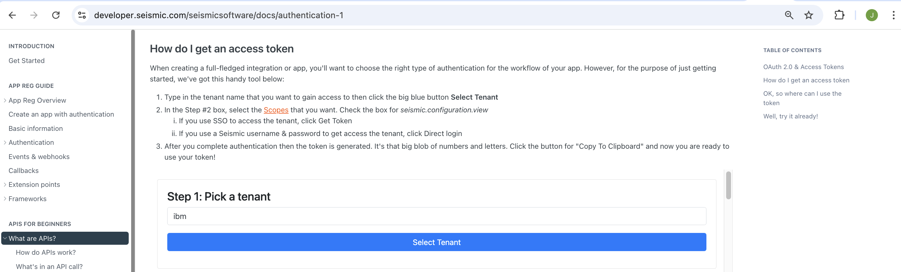
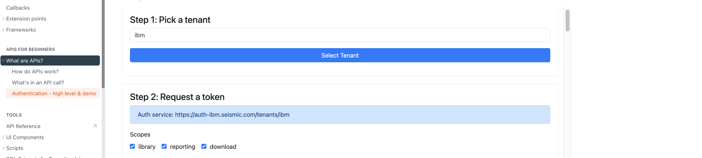
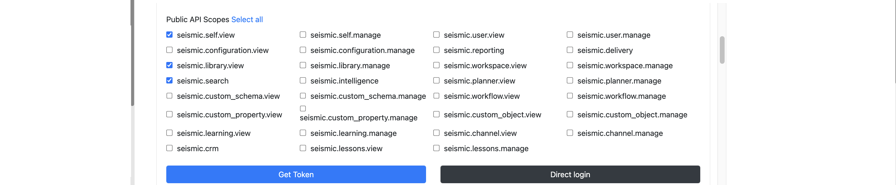
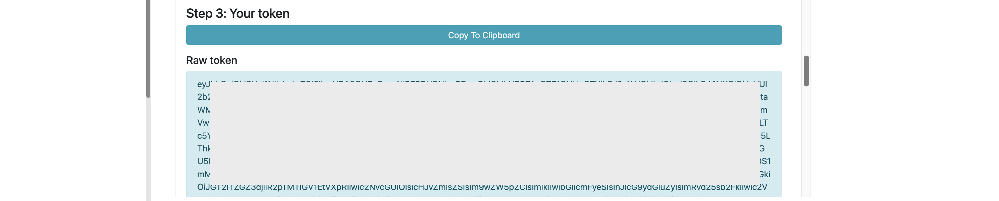

# Seismic API

In this documentation, let’s explore how to access the seismic API.

## Get Access Token 

Here we get the API Token through UI. (Need to find other way to get it permanently).

1. Access this URL in your browser.

https://developer.seismic.com/seismicsoftware/docs/authentication-1

2. Enter the value `IBM` in the below text box.
3. Click `Select Tenant` button


It shows the below page.

4. Select the appropriate checkboxes for the required  permissions for token.
5. Click on `Get Token`




5. It should open a seismic login page. After you complete the login, it should show the below page.

6. Click on `Copy Token`. This is your token.



## Access the APIs.

Here is the list of APIs available.

https://developer.seismic.com/seismicsoftware/reference/reporting-contentsget

1. Here is the python file [seismic.py](./files/seismic.py) to access the APIs

```
import requests

token = "xxxx"
url = "https://api.seismic.com/reporting/v2/contents?limit=1"

headers = {
    "Accept": "application/json",
    "Authorization": f"Bearer {token}"
}

response = requests.get(url, headers=headers)

print(response.text)

```

2. Replace the `token = "xxxx"` with the token that you retrieved in the previous section.

3. Run the python using `python seismic.py` command.

4. You may get output like this [output.json](./files/output.json)

```
[
    {
        "id": "89f5b66c-28b9-4c37-8bed-a10c4600580b",
        "instanceName": "watsonx Client Briefing",
        "libraryContentId": "763f41b4-8dd2-47d7-a8d4-cf8c90177cb5",
        "normalizedName": "watsonx Client Briefing",
        "originRepository": "Library",
        "repository": "WorkSpace",
        "workspaceContentId": "89f5b66c-28b9-4c37-8bed-a10c4600580b",
        "modifiedAt": "2025-01-27T09:12:08.547Z",
        "createdAt": "2024-10-17T12:59:55.127Z",
        "originApplication": null,
        "format": "pptx",
        "isDeleted": false
    },
    {
        "id": "9764e279-0294-4e00-b2d7-9af3b9ca9c18",
        "instanceName": "Cost of a Data Breach Report 2024 - Executive Summary (LiveDoc Version)",
        "libraryContentId": "f5abd0a9-8637-4d77-a604-4368c786baae",
        "normalizedName": "Cost of a Data Breach Report 2024 - Executive Summary (LiveDoc Version)",
        "originRepository": "Library",
        "repository": "WorkSpace",
        "workspaceContentId": "9764e279-0294-4e00-b2d7-9af3b9ca9c18",
        "modifiedAt": "2025-02-03T07:38:45.033Z",
        "createdAt": "2024-08-06T03:18:38.097Z",
        "originApplication": null,
        "format": "pdf",
        "isDeleted": false
    },
    {
        "id": "6b865a1e-f895-40d7-a943-2b6d4245c565",
        "instanceName": "zOS Platform Support - Solution Implementation Guide",
        "libraryContentId": "6b865a1e-f895-40d7-a943-2b6d4245c565",
        "normalizedName": "zOS Platform Support - Solution Implementation Guide",
        "originRepository": "Library",
        "repository": "Library",
        "workspaceContentId": null,
        "modifiedAt": "2024-07-11T10:47:57.520Z",
        "createdAt": "2020-09-07T11:40:40.403Z",
        "originApplication": null,
        "format": "url",
        "isDeleted": true
    },
    {
        "id": "a7cfa68e-ca50-437c-9766-6506855eb6c0",
        "instanceName": "grammys",
        "libraryContentId": null,
        "normalizedName": "grammys",
        "originRepository": "WorkSpace",
        "repository": "WorkSpace",
        "workspaceContentId": "a7cfa68e-ca50-437c-9766-6506855eb6c0",
        "modifiedAt": "2023-08-15T21:12:07.029Z",
        "createdAt": "2023-01-27T02:04:47.333Z",
        "originApplication": null,
        "format": "jpeg",
        "isDeleted": false
    },
    {
        "id": "7ec69a01-4a0a-44d0-9b66-34e4bd1000da",
        "instanceName": "Client Invitation Mail for TechU - Storage_MA_2020-Sep-11 - Miele",
        "libraryContentId": null,
        "normalizedName": "Client Invitation Mail for TechU - Storage_MA_2020-Sep-11 - Miele",
        "originRepository": "WorkSpace",
        "repository": "WorkSpace",
        "workspaceContentId": "7ec69a01-4a0a-44d0-9b66-34e4bd1000da",
        "modifiedAt": "2023-08-15T21:12:07.029Z",
        "createdAt": "2020-09-15T10:54:58.363Z",
        "originApplication": null,
        "format": "docx",
        "isDeleted": true
    }
]
```
